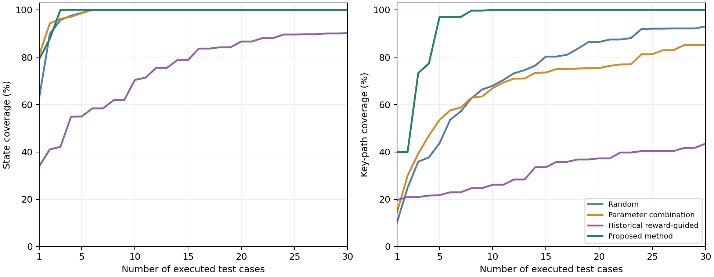

# 面向关键业务路径覆盖的强化学习软件测试设计方法

本仓库提供论文的实验方法代码、固定模型、冻结用例、执行记录及结果复核工具。MAgent2多智能体实验比较随机设计、参数组合设计、历史奖励引导设计和本文方法，评价固定策略、预先设计用例条件下的状态覆盖与关键路径覆盖。

## 公开范围

- v1.1.0补充：3个固定策略模型、20套最终用例及完整参数和种子计划、正式实验逐回合记录及状态轨迹、2352回合标定统计输入、原始冻结证据和公开文件哈希。v1.0.0保持为旧的汇总复核版本。
- 支持：汇总统计复核、依据状态记录重算覆盖、从标定统计输入重建正式用例的配置与顺序、加载固定模型重新执行正式验证计划。
- 不包含：未保存的每步完整观测/动作、标定阶段全部原始逐步轨迹、完整模型训练过程、未纳入终稿的旧实验、论文Word和内部审核材料。状态轨迹不是完整环境观测日志。
- 实际验证范围和操作步骤见[复现说明](docs/REPRODUCIBILITY.md)及[发布验证记录](docs/RELEASE_VALIDATION.md)，不将少量新执行任务说成全量重跑。

## 三个实例的来源与用途

| 实例 | 公开来源 | 本文用途 |
|---|---|---|
| MAgent2 Battlefield | [环境文档](https://magent2.farama.org/environments/battlefield/)；[官方GitHub](https://github.com/Farama-Foundation/MAgent2) | 定量对照实验，软件版本为MAgent2 0.3.4 |
| HighwayEnv高速行车 | [Highway环境文档](https://highway-env.farama.org/environments/highway/)；[官方GitHub](https://github.com/Farama-Foundation/HighwayEnv) | 场景参数、关键路径及评价判据的建模示例，不计入定量结果 |
| Robust-Gymnasium连续控制 | [官方GitHub](https://github.com/SAIL-Research-Lab/Robust-Gymnasium) | 连续控制任务的场景建模示例，不计入定量结果 |

原始环境是第三方项目；论文中的抽象状态、关键路径和覆盖评价由本研究定义，不是上述项目提供的官方测试充分性结论。

## 实验设置与结果

每种方法采用5套设计、3个固定策略模型和20个新环境种子，共300个验证组合。每套30条用例，每条在组合内执行一次，未命中不补跑或换例。每个组合同时评价五条预定义关键业务路径P1-P5。设计阶段使用离线仿真标定资料，不是客户现场数据；正式验证种子未用于该标定。

| 方法 | SC@5/% | KPC@5/% | KPC@10/% | KPC@30/% | KPC-AUC |
|---|---:|---:|---:|---:|---:|
| 随机设计 | 98.74 | 43.67 | 67.93 | 93.00 | 0.7203 |
| 参数组合设计 | 98.56 | 53.53 | 66.93 | 85.13 | 0.6807 |
| 历史奖励引导 | 54.96 | 21.73 | 26.13 | 43.47 | 0.3211 |
| 本文方法 | 100.00 | 97.00 | 100.00 | 100.00 | 0.9403 |

奖励引导采用论文最终使用的几何去重修正版。五条路径100%覆盖仅表示这五条预定义目标均被实际轨迹匹配，不代表软件全部需求和所有状态分支已覆盖。完整结果见[表5数据](results/table5.csv)及[覆盖曲线数据](results/coverage_curves.csv)。



## 结果复核

推荐Python 3.11。以下命令均在本仓库根目录运行，不需要访问未公开数据或模型，也不会执行仿真：

```bash
python scripts/verify_public.py
python -m unittest discover -s tests -v
python scripts/reproduce.py --no-plots
```

安装绘图依赖后生成曲线：

```bash
python -m pip install -r requirements-analysis.txt
python scripts/reproduce.py
```

输出写入默认忽略的`generated/`，包括表5、覆盖曲线、12项统计检验和首次全覆盖位置等辅助汇总。`results/`为预先核验的发布结果，不被默认命令覆盖。

## 目录

| 目录或文件 | 内容 |
|---|---|
| `data/` | 1200个组合的汇总指标，以及稿件表5和最终统计检验的对照值 |
| `artifacts/` | 模型、历史统计输入、最终冻结计划、逐回合执行记录、压缩状态轨迹及来源证据 |
| `results/` | 从上述公开数据生成的表格、曲线和统计结果 |
| `scripts/` | 公开结果复核及发布文件检查脚本 |
| `tests/` | 公开汇总与统计计算的回归测试 |
| `experiment/` | 从最终实验提取、未修改的核心代码依赖集合及第三方allpairspy |
| `docs/` | 指标、数据结构、版本来源、执行条件及公开边界 |
| `MANIFEST.sha256` | 公开发布文件的校验清单 |

## 完整实验代码

独立公开入口为`scripts/replay_experiment.py`。`experiment/`保留原实验代码原始哈希，旧入口包含更多历史批次及未发布文件检查，不应直接作为公开复现命令；其中较早的统计入口不代表论文最终的12项统一Holm比较。

```bash
python scripts/replay_experiment.py verify-records
python -m pip install -r requirements-replay.txt
python scripts/replay_experiment.py verify-design
python scripts/replay_experiment.py rerun --workers 4
# 全量正式验证，新建输出目录，不覆盖已有执行数据
python scripts/replay_experiment.py rerun --full --workers 4 --output generated/full-run
```

重跑默认是预先固定的冒烟检查，不是全部实验。`--full`覆盖正式论文的全部唯一配置、3模型及20环境种子，并还原1200个组合。执行次数与36000个逻辑引用不同，因为相同配置在不同设计中复用同一执行记录。详细字段、环境及操作限制见[复现说明](docs/REPRODUCIBILITY.md)。

## 使用与引用

本文题名为《面向关键业务路径覆盖的强化学习软件测试设计方法》。当前材料不虚构作者、发表年份、DOI或正式开源许可。第三方依赖保留原许可，见[第三方说明](THIRD_PARTY_NOTICES.md)。研究代码和数据的具体再分发许可由权利人另行确认；可在本仓库Issues中提出材料获取或使用申请。
